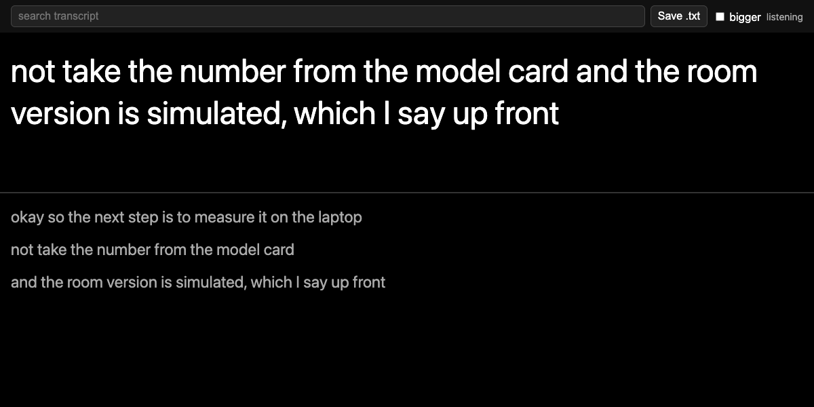

# Offline live captions

This is a live captioning tool that runs fully on my laptop. I measured the
word error rate and latency on my own machine, because I didn't want to just
copy numbers from a model card.

## Why

I read a lot of r/deaf and r/hardofhearing threads about caption apps, and the
same complaints kept coming up. One was monthly minute caps ("I had to make a
throwaway account just to reset the clock"). Another was apps that stop
working as soon as wifi is off ("I turned off wifi and data and transcribe
stopped working"). People also complained about lag that makes conversations
awkward. And one company said nobody would believe a "processing is local"
claim anyway, since users can't check it.

For that last one, I made the code open source and added a test that fails if
the program opens a non-local socket. Running Whisper on the machine takes
care of the other three. What I couldn't find anywhere was how accurate that
really is on a normal laptop, in a room that isn't a studio, with speakers who
don't sound like audiobook narrators. So I measured it.

## Results (Apple M4, 24 GB, mlx-whisper 0.4.3, greedy decoding)

This is word error rate on 300 LibriSpeech test-other utterances, both clean
and in a simulated room. For the room I added synthetic reverb and six
speakers of background babble at a fixed SNR. I didn't record a real room.
METHODOLOGY.md explains exactly how I built it.

<!-- table:wer -->
| model | clean | room, babble 15 dB | room, babble 10 dB | room, babble 5 dB | RTF (clean) |
|---|---|---|---|---|---|
| tiny | 17.2% | 50.5% | 65.3% | 104.1% | 0.025 |
| base | 13.9% | 38.3% | 61.5% | 88.1% | 0.069 |
| small | 9.2% | 21.4% | 35.0% | 58.9% | 0.181 |
| large-v3-turbo | 5.1% | 11.0% | 17.7% | 43.3% | 0.427 |

WER on 300 LibriSpeech test-other utterances. RTF is processing time divided by audio duration on the M4.
<!-- /table -->

On clean read speech the small model gets
**9.2%** of words wrong and large-v3-turbo gets **5.1%**. Meanwhile tiny gets
**17.2%**, so a sentence will often have a wrong word in it. When I add
reverb and other people talking at 5 dB the small model
is at **58.9%**. In a loud room I'd only use any of these models as a rough
help for following along. The real time factor is well under 1 for all four,
so none of them falls behind live speech on this laptop. For example, small runs at **0.181**.

Next I timed how long it takes from the end of speech until the caption shows
up, for different maximum chunk lengths.

<!-- table:latency -->
| model | 2 s chunk | 3 s chunk | 4 s chunk | 6 s chunk | 8 s chunk |
|---|---|---|---|---|---|
| tiny | 0.47 / 0.49 | 0.47 / 0.51 | 0.48 / 0.51 | 0.48 / 0.54 | 0.49 / 0.57 |
| base | 0.52 / 0.55 | 0.52 / 0.57 | 0.54 / 0.59 | 0.53 / 0.61 | 0.53 / 0.63 |
| small | 0.73 / 0.80 | 0.75 / 0.82 | 0.76 / 0.87 | 0.76 / 0.92 | 0.77 / 0.97 |
| large-v3-turbo | 1.48 / 1.71 | 1.44 / 1.49 | 1.69 / 1.79 | 1.72 / 1.82 | 1.73 / 1.89 |

Median / 90th percentile end-of-speech to caption latency in seconds, 60 utterances per cell. Includes the 0.4 s pause the chunker waits for.
<!-- /table -->

With the default 4 s chunk, the small model shows the final words of a
sentence a median latency of **0.76 s** after the speaker stops, and
large-v3-turbo a median latency of **1.69 s**. In a conversation that's a
real difference. With small the caption shows up while the other person is
still looking at you. With large-v3-turbo they've often started their next
sentence already. For tiny and base, most of the wait is the fixed 0.4 s
pause the chunker needs before it decides the sentence is over, and the model
itself is quick. Changing the maximum chunk length barely moves the number.
That's because the last words of a sentence usually land in a short leftover
chunk after the previous cut. So the chunk length mostly changes how often
captions pop up mid-sentence, and it hardly affects how late the last word
arrives.

I also looked at word error rate by self-reported accent on the
`DTU54DL/common-accent` test split. These are crowd-recorded Common Voice
clips, so you can't compare the numbers directly with the LibriSpeech table.

<!-- table:accent -->
| accent (self-reported) | clips | tiny | base | small | large-v3-turbo |
|---|---|---|---|---|---|
| India and South Asia | 346 | 35.2% | 26.9% | 17.3% | 12.9% |
| Southern African | 23 | 34.5% | 33.5% | 23.5% | 22.5% |
| Hong Kong | 16 | 42.8% | 31.7% | 24.1% | 9.0% |
| West Indies and Bermuda | 13 | 32.6% | 28.0% | 15.9% | 12.9% |
| Malaysian | 11 | 44.8% | 32.3% | 22.9% | 10.4% |
| all | 409 | 35.6% | 27.6% | 17.9% | 13.2% |
<!-- /table -->

India and South Asia is the only group with enough clips to mean much, and
there the small model is at **17.3%**. The other groups only have 11 to 23
clips each, so I'd treat their numbers as rough.

Figures: `results/wer_vs_model.png`, `results/latency_vs_chunk.png`,
`results/rtf_per_model.png`, `results/wer_by_accent.png`.

## Limitations

* The far-field room is simulated, with a synthetic RIR and babble taken from
  the same corpus. It gives the direction and rough size of the drop. A real
  café could be better or worse.
* LibriSpeech is read audiobook speech, and it's public, so Whisper may have
  seen it in training. I'd expect conversational speech to do worse.
* The accent set is unbalanced (346 of 451 clips come from one group) and the
  labels are self-reported. There's also no native speaker control from the
  same source. So I can't say how much an accent costs. I can only say how
  the models rank against each other on it.
* Everything ran on one machine, once per cell, with no confidence intervals.
  At this sample size I'd treat WER differences under about a percentage
  point as noise.
* I measured latency by replaying audio through the processing path. I didn't
  use a real microphone loop. Drawing the caption takes a few milliseconds and
  I didn't count it.
* I only used greedy decoding, without temperature fallback. The logbook has
  the details, but the short version is the fallback retries made noisy audio
  20 times slower.
* While I measured RTF, another process (a local LLM benchmark I couldn't
  stop) was using part of the GPU. So treat the RTF column as an upper bound.
  The latency run started after that process had gone quiet.

## Run it

You need Apple Silicon and Python 3.12 (mlx-whisper has no 3.14 wheel yet).

    uv venv -p 3.12 .venv && uv pip install -p .venv/bin/python -r requirements.txt -e .
    mkdir -p models/whisper-small-mlx
    curl -L -o models/whisper-small-mlx/config.json https://huggingface.co/mlx-community/whisper-small-mlx/resolve/main/config.json
    curl -L -o models/whisper-small-mlx/weights.npz https://huggingface.co/mlx-community/whisper-small-mlx/resolve/main/weights.npz
    .venv/bin/python -m livecap --model small --web

Then open http://127.0.0.1:8765/ to get the big caption page. It has a search
box and you can save the text as .txt. The terminal shows the same captions.
`--chunk 2` gives you faster captions but they're a bit less accurate. If
mlx-whisper isn't there, the tool uses `pywhispercpp` or `faster-whisper`
instead, if one of them is installed (`--backend`).

To reproduce the numbers:

    .venv/bin/python scripts/prepare_subset.py       # needs data/LibriSpeech/test-other
    .venv/bin/python scripts/eval_wer.py
    .venv/bin/python scripts/eval_latency.py
    .venv/bin/python scripts/eval_accent.py          # needs data/common-accent-test.parquet
    .venv/bin/python scripts/make_figures.py
    .venv/bin/python scripts/check_numbers.py        # fails if README disagrees with results/

## Privacy, checkable

`tests/test_no_network.py` patches `socket.connect` so any connection to a
non-loopback address raises an error. Then it runs the chunker, the caption
web server and a real transcription through the model, and it passes. The
model weights are read from `models/` on disk. I also set `HF_HUB_OFFLINE=1`
so the Hugging Face library can't phone home. The web page is one file served
on 127.0.0.1 without any external assets. If you still don't trust it, unplug
your network and run it anyway.

## Layout

    livecap/        chunker, ASR backends, terminal UI, web page
    scripts/        subset selection, evaluations, figures, check_numbers
    results/        CSVs and figures that the README numbers come from
    tests/          pytest; CI skips the model test with CI=true
    notes/LOGBOOK.md  dated notes including what went wrong

MIT licence.
